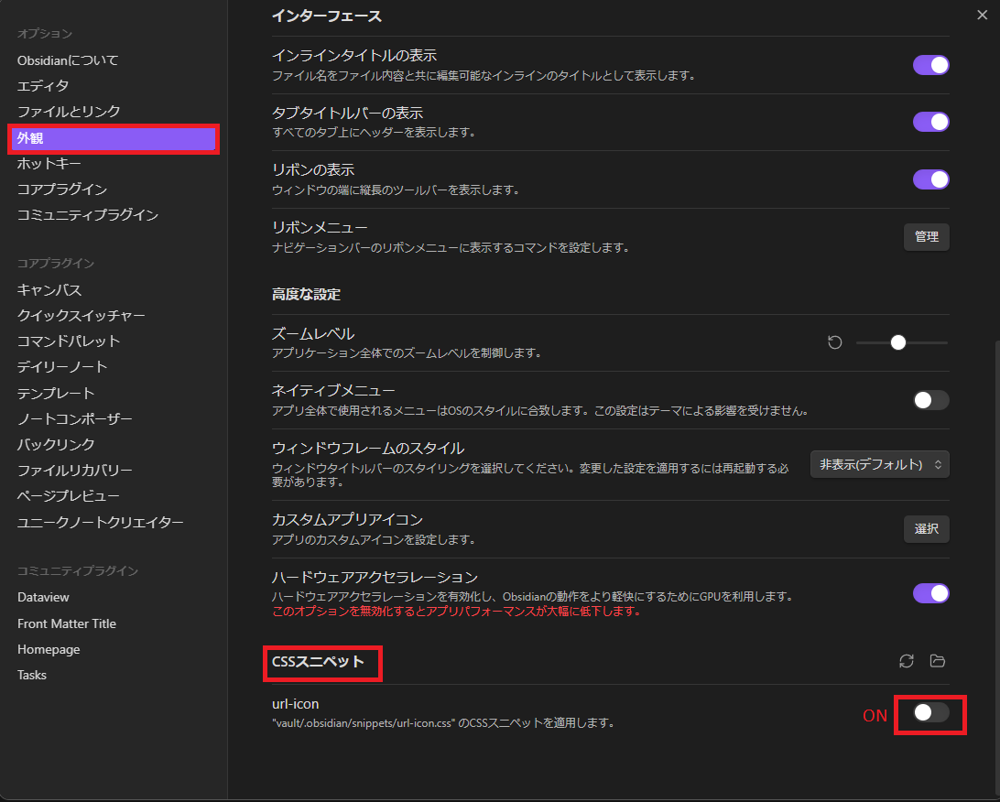

## MOC

- [📆2025-03-11](20250311000000)
- [変更履歴](20250310133303.md)

## 参考サイト

- [📕Obsidianで特定サイトの外部URLにロゴを付与 - Minerva](https://minerva.mamansoft.net/Notes/%F0%9F%93%95Obsidian%E3%81%A7%E7%89%B9%E5%AE%9A%E3%82%B5%E3%82%A4%E3%83%88%E3%81%AE%E5%A4%96%E9%83%A8URL%E3%81%AB%E3%83%AD%E3%82%B4%E3%82%92%E4%BB%98%E4%B8%8E)

## 手順

- `.obsidian/snippets/url-icon.css` を配置
- オプション＞外観＞CSSスニペット＞`url-icon` をON
  

## 動作確認

URLの左側にアイコンが出ていればＯＫ

- [github.com](https://github.com)
- [youtube.com](https://youtube.com)
- [x.com](https://x.com)
- [wikipedia.org](https://wikipedia.org)
