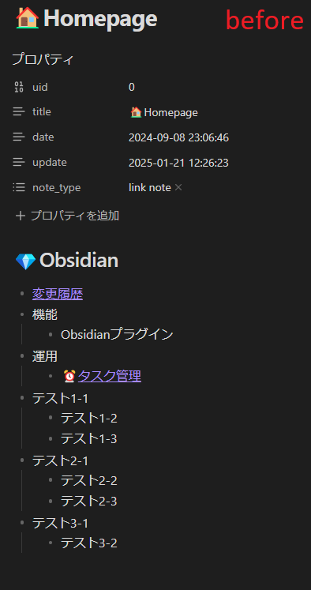
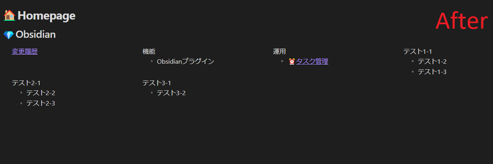

## MOC

- [📆2025-03-11](20250311000000)

## 参考サイト

- [Dashboard++ — a simple organization and navigation method for Obsidian Vaults - Toolbox for Thought](https://tfthacker.com/article-obsidian-dashboardplusplus2022)

## 手順

- `.obsidian/snippets` 配下にcssを配置
  - dashboard.css
  - dashboard-ReadLineLength.css
  - hidden.css
- オプション＞外観＞CSSスニペット 追加したcssをON

## 動作確認

[Homepage](000) に下記をYAML front matterに追加します。

```yaml
cssclasses:
  - hidden
  - dashboard
  - dashboard-ReadLineLength
```

### before

縦長が



### after

横長になっていればOKです。


